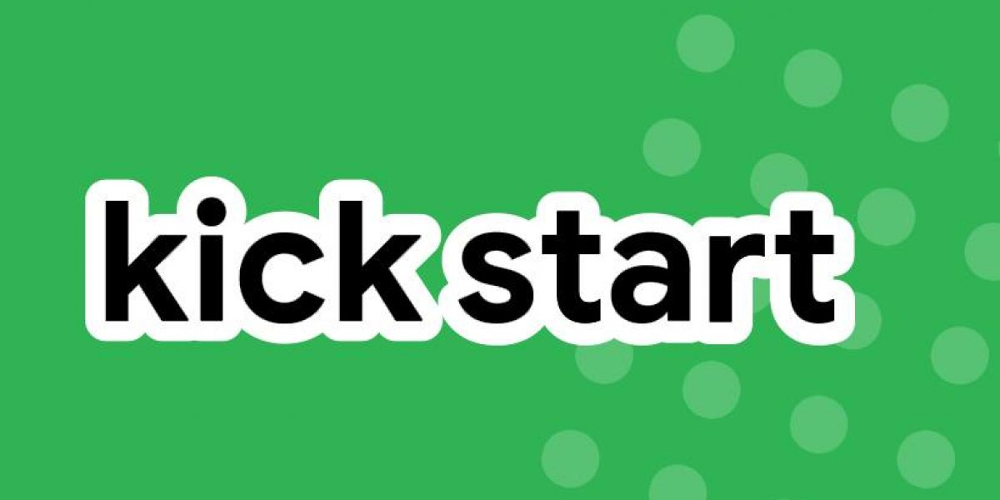

## [Google Kick Start 2020 Solutions](https://github.com/BlankCoders/GoogleKickStart2020_Solutions)

### What is Kick Start?
Kick Start offers coders around the world the chance to develop and hone their programming skills through online-hosted competition rounds. The three-hour rounds feature a variety of algorithmic challenges, all developed by Google engineers so that you get a taste of the technical skills needed for a career at Google (the top competitors from our Kick Start rounds may be invited to interview at Google!). Their rounds are held regularly throughout the year at different times so they are easily accessible to coders everywhere. Each Kick Start Round is open to all participants, no pre-qualification needed, so you can try your hand at one or give them all a shot. 

### Our Aim
If you're stuck at some question, hopefully you'll find this repository useful.

### Who can contribute?
Anyone with a knack for Programming 😜.

### How to contribute?
Visit [CONTRIBUTING.md](https://github.com/BlankCoders/GoogleKickStart2020_Solutions/blob/master/CONTRIBUTING.md) to understand the procedure.

### New to GitHub and don't know how to do things?
Visit [Resources.md](https://github.com/BlankCoders/GoogleKickStart2020_Solutions/blob/master/Resources.md) to know about Git & GitHub.

## Disclaimer
- **Do follow Guidelines.**
- **Plagirism is strongly discouraged.**
- **Regarding PRs:**
    - All the PRs will be marked as **"INVALID"** if you have not been assigned to any issues. To work on this repository, it's necessary to mention on what issue you want to work.  
    - Layout of PR Description:
      ```
      Issue Number for which I'm assigned & worked: #
      (write the issue number after # symbol)
      ```
      Example:
      ```
      Issue Number for which I'm assigned & worked: #3
      ```
      
## Maintainer
- Falguni Sarkar [(@lostgirljourney)](https://github.com/lostgirljourney)
- Aniruddha Das [(@OctoplusNinja)](https://github.com/OctoplusNinja)

(Contact [here](https://github.com/BlankCoders/GoogleKickStart2020_Solutions/discussions/96) for any problem, issues or suggestions!)

## Our valuable Contributors👩‍💻👨‍💻
[](https://github.com/BlankCoders/GoogleKickStart2020_Solutions/graphs/contributors)

## Participating in

